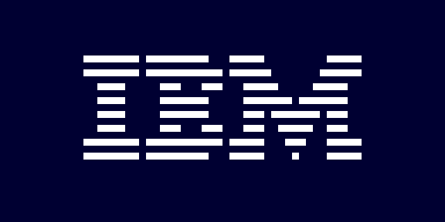
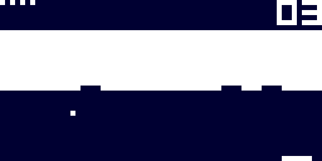
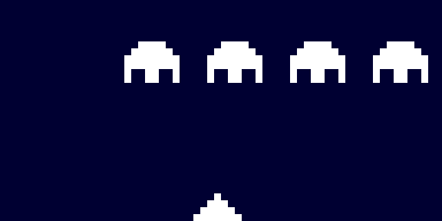

# CHIP-8 Emulator

> **CHIP-8** is an interpreted programming language, developed by Joseph Weisbecker. It was initially used on the COSMAC VIP and Telmac 1800 8-bit microcomputers in the mid-1970s. CHIP-8 programs are run on a CHIP-8 virtual machine. It was made to allow video games to be more easily programmed for these computer             
<br>--[Wikipedia](https://en.wikipedia.org/wiki/Chip-8)

## Introduction

This is a python version CHIP-8 Emulator. Although it was originally created as a virtual machine, CHIP-8 could be treated as a simple game console. As a result, implementing this emulator is a good way to get a brief understanding of how computer works.

## Usage

```
pip3 install pygame
sudo apt install sox
git clone git@github.com:AlpacaMax/Python-CHIP8-Emulator
cd Python-CHIP8-Emulator
python3 chip8.py games/<Your game>
```

## Screenshots








**Note:** If you don't like the color, you can go to `line 154` and `line 155` and change `self.zeroColor` and `self.oneColor`.

## More CHIP-8 ROMs(Games)

Visit [The Old Computer](https://www.theoldcomputer.com/roms/index.php?folder=Chip-8/Chip-8/Games) for more CHIP-8 games